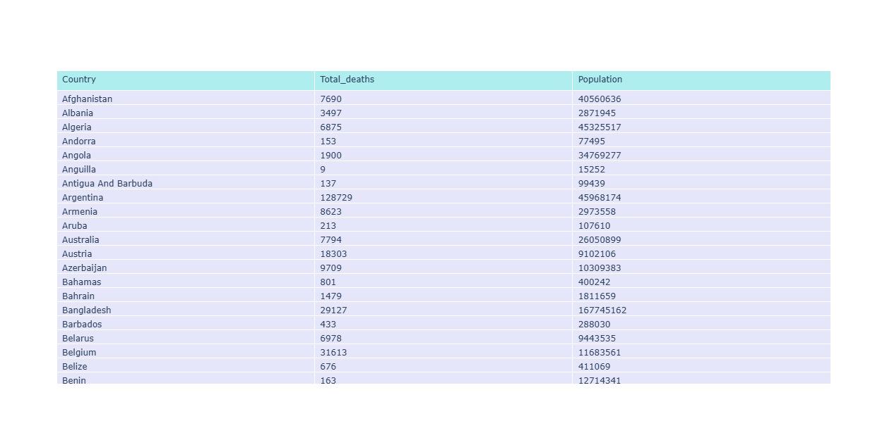
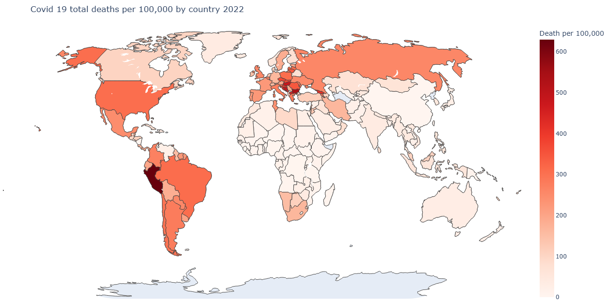
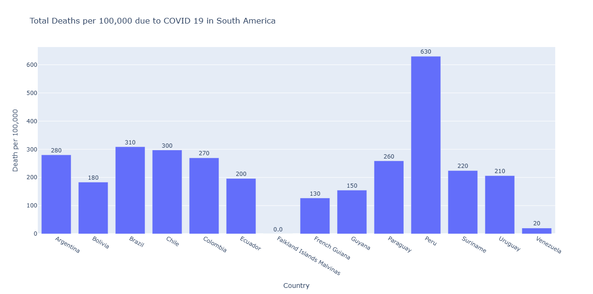

# COVID-19-deaths

## Objective
The objective of this project is to quantitatively assess the global impact of COVID-19. One method of evaluating this impact is by analyzing the number of deaths per 100,000 people. Since the onset of the pandemic in 2020, COVID-19 has resulted in 27 million deaths worldwide by August 2024, placing immense strain on economies and healthcare systems. Throughout the pandemic, various political measures were implemented to control the spread and reduce the death toll, often supported by data-driven research. This project aims to provide a scientific foundation for future policy decisions that countries can adopt to better withstand future pandemics.

## Method 
Global COVID-19 total death data in May 2022, **_[worldometer_coronavirus_summary_data.csv](data-and-code/worldometer_coronavirus_summary_data.csv)_**, is analyzed using Python to identify the country most severely impacted by the pandemic, based on deaths per 100,000 population. Countries are ranked accordingly to highlight disparities in outcomes. A focused case study is then conducted on the most affected country to examine systemic weaknesses within its healthcare infrastructure and public health response. Based on these findings, policy recommendations are proposed to help other nations strengthen their preparedness and resilience, thereby mitigating the impact of future pandemics. 

```math
death\_per\_100,000\_population = \frac{total\_deaths}{population} \times 100,000
```

## The Code
### Libraries Used


 
Importing the libraries used in this project. 
```python
#import python modules
import matplotlib.pyplot as plt
import pandas as pd
import numpy as np
import plotly.express as px
import plotly.io as pio
import plotly.graph_objects as go
```

Extract the columns, country name, total number of deaths, and population from the imported global corona virus data.  Make a new data frame with the extracted columns, then use Plotly to display it as a table.
```python
#import, sort and create new data frame
Data = pd.read_csv("worldometer_coronavirus_summary_data.csv")
countries = Data["country"].unique()
countryname = []
deaths = []
population = []

for country in countries: 
    currentcountry = Data[(Data['country'] == country)]
    countryname.append(country)
    deaths.append(currentcountry['total_deaths'].sum())
    population.append(currentcountry['population'].sum())

newData = pd.DataFrame({'Country': countryname,'Total_deaths': deaths, 'Population': population})

fig3 = go.Figure(data=[go.Table(
    header=dict(values=list(newData.columns),
                fill_color='paleturquoise',
                align='left'),
    cells=dict(values=[newData.Country, newData.Total_deaths, newData.Population],
               fill_color='lavender',
               align='left'))
])
pio.renderers.default = "browser"
fig3.show()
```
<p align="center">


The total number of deaths per 100,000 persons in every country can be determined using this data. The data frame is then updated with this value, and a global map is produced.  The colour gradient shows the COVID-19 outbreak per country in terms of fatalities.

```python
#calculate total deaths per 100,000 in each country and display as colored map 
per = []
for i in range(0,226,1):
    result = (newData.iloc[i,1] / newData.iloc[i,2]) * 100000
    per.append(result)
perarray = np.array(per)

newData1 = pd.DataFrame({'Country': countryname,'Total deaths': deaths, 'Population': population, 'Death per 100,000': perarray})

fig = px.choropleth(
    newData1,
    locations="Country",
    locationmode="country names",         
    color="Death per 100,000",              
    hover_name="Country",           
    color_continuous_scale="Reds", 
    title="Covid 19 deaths per 100,000 by country 2020",
    scope="world",                
    projection="natural earth"
)

fig.update_layout(
    geo=dict(showframe=False, showcoastlines=True),
    margin=dict(l=0, r=0, t=50, b=0)
)

pio.renderers.default = "browser"
fig.show()
```
<p align="center">

    
According to the map, South America had the highest number of COVID-19 deaths per 100,000 persons in 2022. A bar chart of COVID-19 deaths by South American countries is made by zoning into this area.

```python
#bar graph of COVID-19 fatality data in South America 
Data1 = Data[Data["continent"] == 'South America']

countries1 = Data1["country"].unique()
countryname1 = []
death = []
popu = []

for country in countries1:
    currentcountry = Data1[(Data1['country'] == country)]
    countryname1.append(country)
    death.append(currentcountry['total_deaths'].sum())
    popu.append(currentcountry['population'].sum())

newData2 = pd.DataFrame({'Country': countryname1, 'Total Deaths': death, 'Population': popu})

perr = []
for i in range(0,14,1):
    result = (newData2.iloc[i,1] / newData2.iloc[i,2]) * 100000
    perr.append(result)
perrarray = np.array(perr)

newData3 = pd.DataFrame({'Country': countryname1,'Death per 100,000': perrarray})

fig1 = px.bar(newData3, y='Death per 100,000', x='Country', text_auto='.2s',
            title="Total Deaths per 100,000 due to COVID 19 in South America")
fig1.update_traces(textfont_size=12, textangle=0, textposition="outside", cliponaxis=False)
pio.renderers.default = "browser"
fig1.show()
```
<p align="center">


The bar chart shows that Peru had the highest death toll per 100,000 population in 2022. Further insights into the impact of COVID-19 in Peru can be gained by analyzing the trend in death cases from the start of the pandemic in 2020. 
```python


<p align="center">


## COVID-19 in Peru 
In 2022, Peru had more COVID-19 deaths per 100,000 inhabitants than any other country in the world. The country was placed under extreme lockdown as soon as the first case began on March 6, 2020. But the virus continued to spread throughout the nation and by December 31, 2020, there were 1,017,119 confirmed cases and 37,724 fatalities. Lack of hospitalisation and intensive care unit beds as a result of low healthcare investment rates may have contributed to an increase in deaths. There are roughly five intensive care unit beds for every 100,000 people in Peru, and there is a severe shortage of qualified medical personnel in the ICU.

### References
- https://ourworldindata.org/key-charts-understand-covid-pandemic
- https://pmc.ncbi.nlm.nih.gov/articles/PMC10986737/
- https://pmc.ncbi.nlm.nih.gov/articles/PMC8045664/
- https://www.unicef.org/media/92111/file/UNICEF-Peru-COVID-19-Situation-Report-No.-10-End-of-year-2020.pdf

[**_[View full python code](data-and-code/COVID.py)_**]
