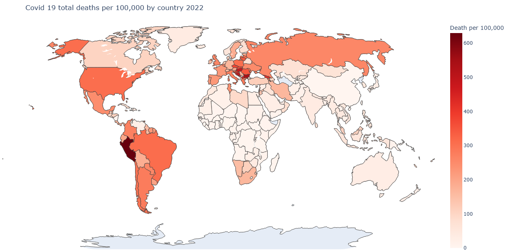

# COVID-19-deaths
Plotly bar charts and world graphs are used in this project to analyse global COVID-19 data from 2020. Finding the number of deaths per 100,000 people is one method of assessing the impact of COVID-19 on a country in 2020. **_[View worldometer_coronavirus_summary_data.csv](data-and-code/worldometer_coronavirus_summary_data.csv)_**

```math
\frac{total\_deaths}{population} \times 100,000
```

## Libraries Used 


## The Code 
Importing the libraries used in this project. 
```python
#import python modules
import matplotlib.pyplot as plt
import pandas as pd
import numpy as np
import plotly.express as px
import plotly.io as pio
import plotly.graph_objects as go
```

Extract the columns, country name, total number of deaths, and population from the imported global corona virus data.  Make a new data frame with the extracted columns, then use Plotly to display it as a table.
```python
#import, sort and create new data frame
Data = pd.read_csv("worldometer_coronavirus_summary_data.csv")
countries = Data["country"].unique()
countryname = []
deaths = []
population = []

for country in countries: 
    currentcountry = Data[(Data['country'] == country)]
    countryname.append(country)
    deaths.append(currentcountry['total_deaths'].sum())
    population.append(currentcountry['population'].sum())

newData = pd.DataFrame({'Country': countryname,'Total_deaths': deaths, 'Population': population})

fig3 = go.Figure(data=[go.Table(
    header=dict(values=list(newData.columns),
                fill_color='paleturquoise',
                align='left'),
    cells=dict(values=[newData.Country, newData.Total_deaths, newData.Population],
               fill_color='lavender',
               align='left'))
])
pio.renderers.default = "browser"
fig3.show()
```


The total number of deaths per 100,000 persons in every country can be determined using this data. The data frame is then updated with this value, and a global map is produced.  The colour gradient shows the COVID-19 outbreak per country in terms of fatalities.

```python
#calculate total deaths per 100,000 in each country and display as colored map 
per = []
for i in range(0,226,1):
    result = (newData.iloc[i,1] / newData.iloc[i,2]) * 100000
    per.append(result)
perarray = np.array(per)

newData1 = pd.DataFrame({'Country': countryname,'Total deaths': deaths, 'Population': population, 'Death per 100,000': perarray})

fig = px.choropleth(
    newData1,
    locations="Country",
    locationmode="country names",         
    color="Death per 100,000",              
    hover_name="Country",           
    color_continuous_scale="Reds", 
    title="Covid 19 deaths per 100,000 by country 2020",
    scope="world",                
    projection="natural earth"
)

fig.update_layout(
    geo=dict(showframe=False, showcoastlines=True),
    margin=dict(l=0, r=0, t=50, b=0)
)

pio.renderers.default = "browser"
fig.show()
```



